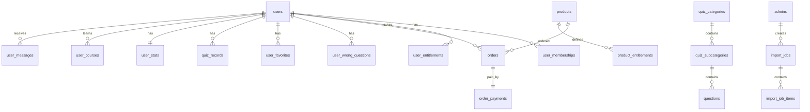

# 圣博培训 V2.0 数据库表结构设计

> **文档版本**：V2.0-draft  
> **编写日期**：2026-08-20  
> **数据库**：MySQL 8.0+  
> **字符集**：utf8mb4 / utf8mb4_unicode_ci  
> **关联文档**：[V2.0 需求说明书](./V2.0-后端支付与题库导入需求说明书.md)、[API 接口文档](./V2.0-API接口文档.md)

---

## 0. 数据库连接环境

| 配置项 | 值 |
|--------|-----|
| 主机 | `182.92.219.39:3306` |
| JDBC | `jdbc:mysql://182.92.219.39:3306/shengbo_training` |
| 用户名 | `train` |
| 密码 | `123qwe` |
| 库名 | `shengbo_training`（待创建） |

详细说明与环境变量配置见 [需求说明书 §4.1](./V2.0-后端支付与题库导入需求说明书.md#41-数据库环境配置mysql)。

---

## 1. 设计原则

- 用户以微信 **openid** 为业务唯一标识（`users.openid` UNIQUE）
- 金额单位：**分**（INT），避免浮点误差
- 时间字段：UTC 存储，展示层转东八区
- 软删除：核心表使用 `deleted_at`，便于审计与恢复
- 主键：业务表使用 **BIGINT 自增**；对外暴露使用 **UUID 或业务编码**（如 `order_no`）

---

## 2. ER 关系概览



---

## 3. 表清单

| 序号 | 表名 | 说明 | 模块 |
|------|------|------|------|
| 1 | users | 小程序用户 | 用户 |
| 2 | user_sessions | 登录 token | 用户 |
| 3 | user_memberships | 会员记录 | 用户 |
| 4 | user_entitlements | 用户权益 | 用户 |
| 5 | user_stats | 学习统计汇总 | 用户 |
| 6 | user_courses | 课程学习进度 | 用户 |
| 7 | user_wrong_questions | 错题本 | 题库 |
| 8 | user_favorites | 收藏题目 | 题库 |
| 9 | quiz_records | 答题记录 | 题库 |
| 10 | quiz_answer_logs | 单题作答明细 | 题库 |
| 11 | products | 虚拟商品 | 商城 |
| 12 | product_entitlements | 商品权益配置 | 商城 |
| 13 | orders | 订单 | 商城 |
| 14 | order_payments | 支付流水 | 商城 |
| 15 | refund_records | 退款记录 | 商城 |
| 16 | courses | 课程 | 内容 |
| 17 | course_lessons | 课程课时 | 内容 |
| 18 | quiz_categories | 题库大类 | 题库 |
| 19 | quiz_subcategories | 题库子章节 | 题库 |
| 20 | questions | 题目 | 题库 |
| 21 | import_jobs | 导入任务 | 题库 |
| 22 | import_job_items | 导入明细/错误行 | 题库 |
| 23 | banners | 首页轮播 | 内容 |
| 24 | announcements | 公告 | 内容 |
| 25 | user_messages | 用户消息 | 内容 |
| 26 | admins | 后台管理员 | 系统 |
| 27 | admin_roles | 角色 | 系统 |
| 28 | system_configs | 系统配置 | 系统 |

---

## 4. 用户模块

### 4.1 users — 小程序用户

| 字段 | 类型 | 空 | 默认 | 说明 |
|------|------|----|------|------|
| id | BIGINT UNSIGNED | N | AUTO | 主键 |
| openid | VARCHAR(64) | N | | 微信 openid，UNIQUE |
| unionid | VARCHAR(64) | Y | NULL | 微信 unionid（可选） |
| nick_name | VARCHAR(64) | Y | NULL | 昵称 |
| avatar_url | VARCHAR(512) | Y | NULL | 头像 URL |
| gender | TINYINT | Y | 0 | 0未知 1男 2女 |
| phone | VARCHAR(20) | Y | NULL | 手机号（后续扩展） |
| status | TINYINT | N | 1 | 1正常 0禁用 |
| last_login_at | DATETIME | Y | NULL | 最后登录时间 |
| created_at | DATETIME | N | CURRENT_TIMESTAMP | |
| updated_at | DATETIME | N | CURRENT_TIMESTAMP ON UPDATE | |
| deleted_at | DATETIME | Y | NULL | 软删除 |

**索引**：
- `uk_openid (openid)` UNIQUE
- `idx_status (status)`
- `idx_created_at (created_at)`

---

### 4.2 user_sessions — 登录会话

| 字段 | 类型 | 空 | 说明 |
|------|------|----|------|
| id | BIGINT UNSIGNED | N | 主键 |
| user_id | BIGINT UNSIGNED | N | FK → users.id |
| token | VARCHAR(128) | N | JWT 或随机 token，UNIQUE |
| expires_at | DATETIME | N | 过期时间 |
| client_type | VARCHAR(16) | N | miniapp |
| created_at | DATETIME | N | |

**索引**：`uk_token (token)`，`idx_user_id (user_id)`，`idx_expires_at (expires_at)`

---

### 4.3 user_memberships — 会员

| 字段 | 类型 | 空 | 说明 |
|------|------|----|------|
| id | BIGINT UNSIGNED | N | 主键 |
| user_id | BIGINT UNSIGNED | N | FK → users.id |
| level | VARCHAR(16) | N | month / year / lifetime |
| source_product_id | BIGINT UNSIGNED | Y | 来源商品 FK → products.id |
| source_order_id | BIGINT UNSIGNED | Y | 来源订单 FK → orders.id |
| started_at | DATETIME | N | 生效时间 |
| expire_at | DATETIME | Y | NULL=终身 |
| status | TINYINT | N | 1有效 0过期 2取消 |
| created_at | DATETIME | N | |
| updated_at | DATETIME | N | |

**索引**：`idx_user_status (user_id, status)`，`idx_expire_at (expire_at)`

**业务规则**：同一用户可有多条历史记录；判断会员以 `status=1 AND (expire_at IS NULL OR expire_at > NOW())` 为准。

---

### 4.4 user_entitlements — 用户权益

| 字段 | 类型 | 空 | 说明 |
|------|------|----|------|
| id | BIGINT UNSIGNED | N | 主键 |
| user_id | BIGINT UNSIGNED | N | FK → users.id |
| entitlement_type | VARCHAR(32) | N | category / course / exam_pack / all |
| resource_id | VARCHAR(64) | Y | 资源 ID，如 nanny、c1、nanny_exam；all 时为 NULL |
| source_product_id | BIGINT UNSIGNED | Y | 来源商品 |
| source_order_id | BIGINT UNSIGNED | Y | 来源订单 |
| expire_at | DATETIME | Y | NULL=永久 |
| status | TINYINT | N | 1有效 0失效 |
| created_at | DATETIME | N | |
| updated_at | DATETIME | N | |

**索引**：`idx_user_type (user_id, entitlement_type, status)`，`uk_user_resource (user_id, entitlement_type, resource_id, source_order_id)` UNIQUE

**entitlement_type 枚举**：

| 值 | 含义 | resource_id 示例 |
|----|------|------------------|
| all | 全站解锁（会员） | NULL |
| category | 题库大类 | nanny / housekeeper |
| course | 单门课程 | c1 |
| exam_pack | 冲刺题库包 | nanny_exam |

---

### 4.5 user_stats — 学习统计汇总

| 字段 | 类型 | 空 | 说明 |
|------|------|----|------|
| user_id | BIGINT UNSIGNED | N | PK，FK → users.id |
| total_answered | INT UNSIGNED | N | 0 | 累计答题数 |
| total_correct | INT UNSIGNED | N | 0 | 累计答对数 |
| exam_high_score | INT UNSIGNED | N | 0 | 模拟考最高分 |
| study_days | INT UNSIGNED | N | 1 | 累计学习天数 |
| last_study_date | DATE | Y | NULL | 最后学习日期 |
| updated_at | DATETIME | N | |

---

### 4.6 user_courses — 课程学习

| 字段 | 类型 | 空 | 说明 |
|------|------|----|------|
| id | BIGINT UNSIGNED | N | 主键 |
| user_id | BIGINT UNSIGNED | N | FK → users.id |
| course_id | BIGINT UNSIGNED | N | FK → courses.id |
| progress | TINYINT UNSIGNED | N | 0 | 进度 0~100 |
| learned_lessons | JSON | Y | NULL | 已学课时 ID 数组 |
| started_at | DATETIME | Y | NULL | |
| completed_at | DATETIME | Y | NULL | |
| updated_at | DATETIME | N | |

**索引**：`uk_user_course (user_id, course_id)` UNIQUE

---

## 5. 商城与支付模块

### 5.1 products — 虚拟商品

| 字段 | 类型 | 空 | 说明 |
|------|------|----|------|
| id | BIGINT UNSIGNED | N | 主键 |
| product_code | VARCHAR(32) | N | 业务编码，如 p1，UNIQUE |
| type | VARCHAR(16) | N | course / package / membership / exam |
| title | VARCHAR(128) | N | 商品名称 |
| cover_url | VARCHAR(512) | Y | 封面图 |
| cover_color | VARCHAR(16) | Y | 封面色（无图时） |
| price | INT UNSIGNED | N | 售价（分） |
| original_price | INT UNSIGNED | N | 原价（分） |
| description | TEXT | Y | 描述 |
| benefits | JSON | Y | 权益文案数组 |
| target_audience | VARCHAR(128) | Y | 适用人群 |
| membership_level | VARCHAR(16) | Y | month/year/lifetime |
| membership_days | INT | Y | 会员天数，-1=终身 |
| sales_count | INT UNSIGNED | N | 0 | 销量 |
| rating | DECIMAL(3,1) | N | 5.0 | 评分 |
| sort_order | INT | N | 0 | 排序 |
| status | TINYINT | N | 1 | 1上架 0下架 |
| created_at | DATETIME | N | |
| updated_at | DATETIME | N | |
| deleted_at | DATETIME | Y | NULL | |

**索引**：`uk_product_code (product_code)`，`idx_type_status (type, status)`

---

### 5.2 product_entitlements — 商品权益配置

| 字段 | 类型 | 空 | 说明 |
|------|------|----|------|
| id | BIGINT UNSIGNED | N | 主键 |
| product_id | BIGINT UNSIGNED | N | FK → products.id |
| entitlement_type | VARCHAR(32) | N | 同 user_entitlements |
| resource_id | VARCHAR(64) | Y | 解锁资源 ID |
| created_at | DATETIME | N | |

**说明**：购买 `product_id` 后，批量写入 `user_entitlements`。

---

### 5.3 orders — 订单

| 字段 | 类型 | 空 | 说明 |
|------|------|----|------|
| id | BIGINT UNSIGNED | N | 主键 |
| order_no | VARCHAR(32) | N | SB202608200001，UNIQUE |
| user_id | BIGINT UNSIGNED | N | FK → users.id |
| product_id | BIGINT UNSIGNED | N | FK → products.id |
| product_title | VARCHAR(128) | N | 下单快照 |
| amount | INT UNSIGNED | N | 应付金额（分） |
| status | VARCHAR(16) | N | pending/paid/closed/refunded |
| pay_expire_at | DATETIME | Y | 支付超时时间 |
| paid_at | DATETIME | Y | 支付时间 |
| closed_at | DATETIME | Y | 关闭时间 |
| refunded_at | DATETIME | Y | 退款时间 |
| remark | VARCHAR(256) | Y | 备注 |
| created_at | DATETIME | N | |
| updated_at | DATETIME | N | |

**索引**：`uk_order_no (order_no)`，`idx_user_status (user_id, status)`，`idx_created_at (created_at)`

**status 枚举**：

| 值 | 说明 |
|----|------|
| pending | 待支付 |
| paid | 已支付 |
| closed | 已关闭（超时/取消） |
| refunded | 已退款 |

---

### 5.4 order_payments — 支付流水

| 字段 | 类型 | 空 | 说明 |
|------|------|----|------|
| id | BIGINT UNSIGNED | N | 主键 |
| order_id | BIGINT UNSIGNED | N | FK → orders.id |
| user_id | BIGINT UNSIGNED | N | FK → users.id |
| pay_channel | VARCHAR(16) | N | wechat |
| transaction_id | VARCHAR(64) | Y | 微信支付单号，UNIQUE |
| prepay_id | VARCHAR(64) | Y | 预支付 ID |
| amount | INT UNSIGNED | N | 实付（分） |
| status | VARCHAR(16) | N | pending/success/fail |
| notify_raw | JSON | Y | 回调原文 |
| paid_at | DATETIME | Y | |
| created_at | DATETIME | N | |

**索引**：`uk_transaction_id (transaction_id)`，`idx_order_id (order_id)`

---

### 5.5 refund_records — 退款记录

| 字段 | 类型 | 空 | 说明 |
|------|------|----|------|
| id | BIGINT UNSIGNED | N | 主键 |
| order_id | BIGINT UNSIGNED | N | FK → orders.id |
| refund_no | VARCHAR(32) | N | 退款单号，UNIQUE |
| amount | INT UNSIGNED | N | 退款金额（分） |
| reason | VARCHAR(256) | Y | 退款原因 |
| operator_id | BIGINT UNSIGNED | Y | 操作管理员 |
| status | VARCHAR(16) | N | pending/success/fail |
| refunded_at | DATETIME | Y | |
| created_at | DATETIME | N | |

---

## 6. 题库模块

### 6.1 quiz_categories — 题库大类

| 字段 | 类型 | 空 | 说明 |
|------|------|----|------|
| id | BIGINT UNSIGNED | N | 主键 |
| category_code | VARCHAR(32) | N | nanny / housekeeper，UNIQUE |
| name | VARCHAR(64) | N | 显示名称 |
| icon | VARCHAR(16) | Y | emoji 或图标 |
| description | VARCHAR(256) | Y | |
| sort_order | INT | N | 0 |
| status | TINYINT | N | 1 |
| created_at | DATETIME | N | |
| updated_at | DATETIME | N | |

---

### 6.2 quiz_subcategories — 子章节

| 字段 | 类型 | 空 | 说明 |
|------|------|----|------|
| id | BIGINT UNSIGNED | N | 主键 |
| category_id | BIGINT UNSIGNED | N | FK → quiz_categories.id |
| sub_code | VARCHAR(32) | N | 如 n_newborn |
| name | VARCHAR(64) | N | |
| is_free | TINYINT(1) | N | 0 | 是否免费章节 |
| sort_order | INT | N | 0 |
| status | TINYINT | N | 1 |
| created_at | DATETIME | N | |
| updated_at | DATETIME | N | |

**索引**：`uk_category_sub (category_id, sub_code)` UNIQUE

---

### 6.3 questions — 题目

| 字段 | 类型 | 空 | 说明 |
|------|------|----|------|
| id | BIGINT UNSIGNED | N | 主键 |
| question_code | VARCHAR(32) | N | 业务编码 q001，UNIQUE |
| category_id | BIGINT UNSIGNED | N | FK |
| subcategory_id | BIGINT UNSIGNED | N | FK |
| type | VARCHAR(16) | N | single/multiple/judge |
| stem | TEXT | N | 题干 |
| options | JSON | N | ["选项A","选项B",...] |
| answer | JSON | N | [0,2] 正确选项索引 |
| analysis | TEXT | Y | 解析 |
| knowledge | VARCHAR(128) | Y | 知识点 |
| is_free | TINYINT(1) | N | 0 |
| difficulty | TINYINT | Y | 1~5 |
| status | VARCHAR(16) | N | draft/published/offline |
| import_job_id | BIGINT UNSIGNED | Y | 来源导入任务 |
| created_at | DATETIME | N | |
| updated_at | DATETIME | N | |
| deleted_at | DATETIME | Y | NULL |

**索引**：
- `uk_question_code (question_code)`
- `idx_sub_status (subcategory_id, status)`
- `idx_category_status (category_id, status)`
- `FULLTEXT idx_stem (stem)` 可选，后台搜索用

---

### 6.4 user_wrong_questions — 错题本

| 字段 | 类型 | 空 | 说明 |
|------|------|----|------|
| id | BIGINT UNSIGNED | N | 主键 |
| user_id | BIGINT UNSIGNED | N | |
| question_id | BIGINT UNSIGNED | N | FK → questions.id |
| wrong_count | INT UNSIGNED | N | 1 | 错误次数 |
| last_wrong_at | DATETIME | N | |
| cleared_at | DATETIME | Y | 手动清除时间 |
| created_at | DATETIME | N | |

**索引**：`uk_user_question (user_id, question_id)` UNIQUE，`idx_user_id (user_id)`

---

### 6.5 user_favorites — 收藏

| 字段 | 类型 | 空 | 说明 |
|------|------|----|------|
| id | BIGINT UNSIGNED | N | 主键 |
| user_id | BIGINT UNSIGNED | N | |
| question_id | BIGINT UNSIGNED | N | |
| created_at | DATETIME | N | |

**索引**：`uk_user_question (user_id, question_id)` UNIQUE

---

### 6.6 quiz_records — 答题记录（场次）

| 字段 | 类型 | 空 | 说明 |
|------|------|----|------|
| id | BIGINT UNSIGNED | N | 主键 |
| user_id | BIGINT UNSIGNED | N | |
| mode | VARCHAR(16) | N | chapter/special/mock/wrong/favorite |
| category_id | BIGINT UNSIGNED | Y | |
| subcategory_id | BIGINT UNSIGNED | Y | |
| total_count | INT UNSIGNED | N | 总题数 |
| correct_count | INT UNSIGNED | N | 答对数 |
| score | INT UNSIGNED | N | 得分 0~100 |
| duration_sec | INT UNSIGNED | Y | 用时（秒） |
| created_at | DATETIME | N | |

**索引**：`idx_user_created (user_id, created_at DESC)`

---

### 6.7 quiz_answer_logs — 单题作答明细

| 字段 | 类型 | 空 | 说明 |
|------|------|----|------|
| id | BIGINT UNSIGNED | N | 主键 |
| record_id | BIGINT UNSIGNED | Y | FK → quiz_records.id |
| user_id | BIGINT UNSIGNED | N | |
| question_id | BIGINT UNSIGNED | N | |
| user_answer | JSON | N | 用户答案索引 |
| is_correct | TINYINT(1) | N | |
| answered_at | DATETIME | N | |

**索引**：`idx_user_question (user_id, question_id)`

---

### 6.8 import_jobs — 题库导入任务

| 字段 | 类型 | 空 | 说明 |
|------|------|----|------|
| id | BIGINT UNSIGNED | N | 主键 |
| admin_id | BIGINT UNSIGNED | N | FK → admins.id |
| file_name | VARCHAR(256) | N | 原文件名 |
| file_url | VARCHAR(512) | N | OSS 地址 |
| file_type | VARCHAR(16) | N | xlsx/docx/txt |
| category_id | BIGINT UNSIGNED | Y | 默认大类 |
| subcategory_id | BIGINT UNSIGNED | Y | 默认子章节 |
| default_is_free | TINYINT(1) | N | 0 |
| status | VARCHAR(16) | N | pending/preview/ importing/success/partial/fail |
| total_rows | INT | N | 0 |
| success_rows | INT | N | 0 |
| fail_rows | INT | N | 0 |
| error_summary | TEXT | Y | |
| created_at | DATETIME | N | |
| finished_at | DATETIME | Y | |

---

### 6.9 import_job_items — 导入行明细

| 字段 | 类型 | 空 | 说明 |
|------|------|----|------|
| id | BIGINT UNSIGNED | N | 主键 |
| import_job_id | BIGINT UNSIGNED | N | |
| row_no | INT | N | Excel 行号 |
| raw_data | JSON | Y | 原始行数据 |
| parsed_data | JSON | Y | 解析结果 |
| question_id | BIGINT UNSIGNED | Y | 入库后的题目 ID |
| status | VARCHAR(16) | N | success/fail/skipped |
| error_message | VARCHAR(512) | Y | |
| created_at | DATETIME | N | |

---

## 7. 内容模块

### 7.1 courses — 课程

| 字段 | 类型 | 空 | 说明 |
|------|------|----|------|
| id | BIGINT UNSIGNED | N | 主键 |
| course_code | VARCHAR(32) | N | c1，UNIQUE |
| title | VARCHAR(128) | N | |
| category_code | VARCHAR(32) | N | nanny/housekeeper/care/... |
| level | VARCHAR(16) | Y | 入门/核心/进阶 |
| duration_text | VARCHAR(32) | Y | 6 课时 |
| price | INT UNSIGNED | N | 0 | 分，0=免费 |
| description | TEXT | Y | |
| outline | JSON | Y | 大纲数组 |
| sort_order | INT | N | 0 |
| status | TINYINT | N | 1 |
| created_at | DATETIME | N | |
| updated_at | DATETIME | N | |

---

### 7.2 course_lessons — 课时

| 字段 | 类型 | 空 | 说明 |
|------|------|----|------|
| id | BIGINT UNSIGNED | N | 主键 |
| course_id | BIGINT UNSIGNED | N | FK |
| title | VARCHAR(128) | N | |
| duration_text | VARCHAR(16) | Y | 15分钟 |
| content_type | VARCHAR(16) | N | article/video |
| content_url | VARCHAR(512) | Y | 图文或视频地址 |
| sort_order | INT | N | 0 |
| status | TINYINT | N | 1 |
| created_at | DATETIME | N | |

---

### 7.3 banners / announcements / user_messages

结构类似，字段包括：`id, title, content/image_url, link_url, sort_order, status, start_at, end_at, created_at`。

`user_messages` 额外：`user_id, is_read, read_at`。

---

## 8. 系统模块

### 8.1 admins — 后台管理员

| 字段 | 类型 | 说明 |
|------|------|------|
| id | BIGINT | 主键 |
| username | VARCHAR(64) | UNIQUE |
| password_hash | VARCHAR(128) | bcrypt |
| real_name | VARCHAR(64) | |
| role_id | BIGINT | FK → admin_roles.id |
| status | TINYINT | 1启用 |
| last_login_at | DATETIME | |
| created_at / updated_at | DATETIME | |

### 8.2 admin_roles — 角色

| 字段 | 类型 | 说明 |
|------|------|------|
| id | BIGINT | 主键 |
| code | VARCHAR(32) | super_admin/operator/finance |
| name | VARCHAR(64) | 显示名 |
| permissions | JSON | 权限码数组 |

### 8.3 system_configs — 系统配置

| 字段 | 类型 | 说明 |
|------|------|------|
| config_key | VARCHAR(64) | PK，如 pay.refund_days |
| config_value | TEXT | JSON 或字符串 |
| description | VARCHAR(256) | |

---

## 9. 初始化 DDL 示例（核心表）

```sql
CREATE DATABASE IF NOT EXISTS shengbo_training
  DEFAULT CHARACTER SET utf8mb4
  DEFAULT COLLATE utf8mb4_unicode_ci;

-- 连接：mysql -h 182.92.219.39 -P 3306 -u train -p shengbo_training

USE shengbo_training;

CREATE TABLE users (
  id BIGINT UNSIGNED NOT NULL AUTO_INCREMENT,
  openid VARCHAR(64) NOT NULL,
  unionid VARCHAR(64) DEFAULT NULL,
  nick_name VARCHAR(64) DEFAULT NULL,
  avatar_url VARCHAR(512) DEFAULT NULL,
  gender TINYINT DEFAULT 0,
  phone VARCHAR(20) DEFAULT NULL,
  status TINYINT NOT NULL DEFAULT 1,
  last_login_at DATETIME DEFAULT NULL,
  created_at DATETIME NOT NULL DEFAULT CURRENT_TIMESTAMP,
  updated_at DATETIME NOT NULL DEFAULT CURRENT_TIMESTAMP ON UPDATE CURRENT_TIMESTAMP,
  deleted_at DATETIME DEFAULT NULL,
  PRIMARY KEY (id),
  UNIQUE KEY uk_openid (openid),
  KEY idx_status (status)
) ENGINE=InnoDB;

CREATE TABLE products (
  id BIGINT UNSIGNED NOT NULL AUTO_INCREMENT,
  product_code VARCHAR(32) NOT NULL,
  type VARCHAR(16) NOT NULL,
  title VARCHAR(128) NOT NULL,
  cover_url VARCHAR(512) DEFAULT NULL,
  cover_color VARCHAR(16) DEFAULT NULL,
  price INT UNSIGNED NOT NULL,
  original_price INT UNSIGNED NOT NULL,
  description TEXT,
  benefits JSON,
  target_audience VARCHAR(128) DEFAULT NULL,
  membership_level VARCHAR(16) DEFAULT NULL,
  membership_days INT DEFAULT NULL,
  sales_count INT UNSIGNED NOT NULL DEFAULT 0,
  rating DECIMAL(3,1) NOT NULL DEFAULT 5.0,
  sort_order INT NOT NULL DEFAULT 0,
  status TINYINT NOT NULL DEFAULT 1,
  created_at DATETIME NOT NULL DEFAULT CURRENT_TIMESTAMP,
  updated_at DATETIME NOT NULL DEFAULT CURRENT_TIMESTAMP ON UPDATE CURRENT_TIMESTAMP,
  deleted_at DATETIME DEFAULT NULL,
  PRIMARY KEY (id),
  UNIQUE KEY uk_product_code (product_code)
) ENGINE=InnoDB;

CREATE TABLE orders (
  id BIGINT UNSIGNED NOT NULL AUTO_INCREMENT,
  order_no VARCHAR(32) NOT NULL,
  user_id BIGINT UNSIGNED NOT NULL,
  product_id BIGINT UNSIGNED NOT NULL,
  product_title VARCHAR(128) NOT NULL,
  amount INT UNSIGNED NOT NULL,
  status VARCHAR(16) NOT NULL DEFAULT 'pending',
  pay_expire_at DATETIME DEFAULT NULL,
  paid_at DATETIME DEFAULT NULL,
  closed_at DATETIME DEFAULT NULL,
  refunded_at DATETIME DEFAULT NULL,
  remark VARCHAR(256) DEFAULT NULL,
  created_at DATETIME NOT NULL DEFAULT CURRENT_TIMESTAMP,
  updated_at DATETIME NOT NULL DEFAULT CURRENT_TIMESTAMP ON UPDATE CURRENT_TIMESTAMP,
  PRIMARY KEY (id),
  UNIQUE KEY uk_order_no (order_no),
  KEY idx_user_status (user_id, status)
) ENGINE=InnoDB;

CREATE TABLE questions (
  id BIGINT UNSIGNED NOT NULL AUTO_INCREMENT,
  question_code VARCHAR(32) NOT NULL,
  category_id BIGINT UNSIGNED NOT NULL,
  subcategory_id BIGINT UNSIGNED NOT NULL,
  type VARCHAR(16) NOT NULL,
  stem TEXT NOT NULL,
  options JSON NOT NULL,
  answer JSON NOT NULL,
  analysis TEXT,
  knowledge VARCHAR(128) DEFAULT NULL,
  is_free TINYINT(1) NOT NULL DEFAULT 0,
  difficulty TINYINT DEFAULT 1,
  status VARCHAR(16) NOT NULL DEFAULT 'draft',
  import_job_id BIGINT UNSIGNED DEFAULT NULL,
  created_at DATETIME NOT NULL DEFAULT CURRENT_TIMESTAMP,
  updated_at DATETIME NOT NULL DEFAULT CURRENT_TIMESTAMP ON UPDATE CURRENT_TIMESTAMP,
  deleted_at DATETIME DEFAULT NULL,
  PRIMARY KEY (id),
  UNIQUE KEY uk_question_code (question_code),
  KEY idx_sub_status (subcategory_id, status)
) ENGINE=InnoDB;
```

> 完整 28 张表 DDL 可在开发阶段按模块分批执行；上文为核心表示例。

---

## 10. 数据迁移（V1.0 → V2.0）

| V1.0 本地 key | V2.0 目标表 |
|---------------|-------------|
| sb_user | users |
| sb_membership | user_memberships |
| sb_purchased | user_entitlements（需映射 product_code） |
| sb_orders | orders |
| sb_wrong | user_wrong_questions |
| sb_favorite | user_favorites |
| sb_records | quiz_records |
| sb_quiz_stats | user_stats |
| learnedIds | user_courses |

**说明**：V1.0 无 openid 绑定，历史本地数据 **无法自动迁移**；V2.0 上线后用户重新登录从云端开始。

---

**文档状态**：待评审
